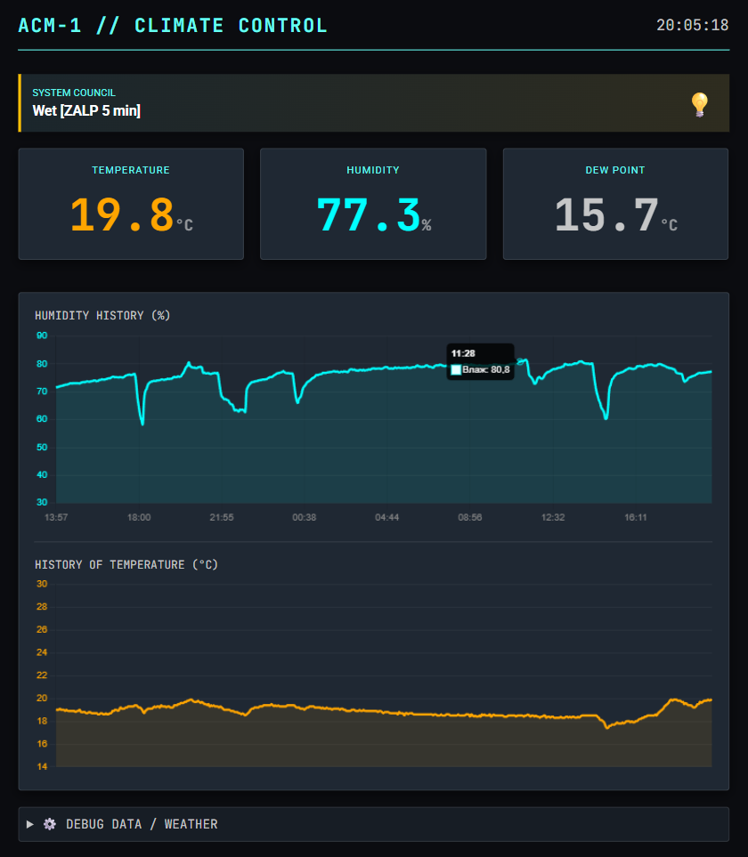
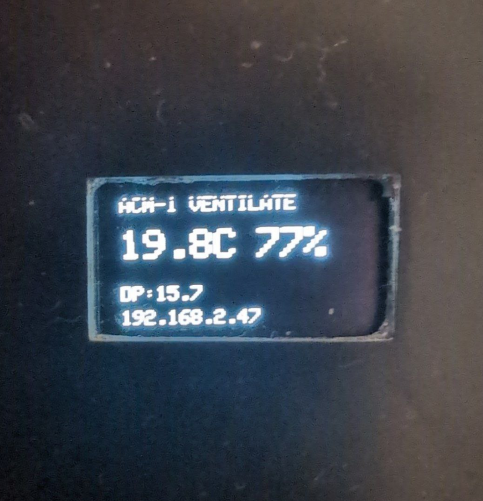
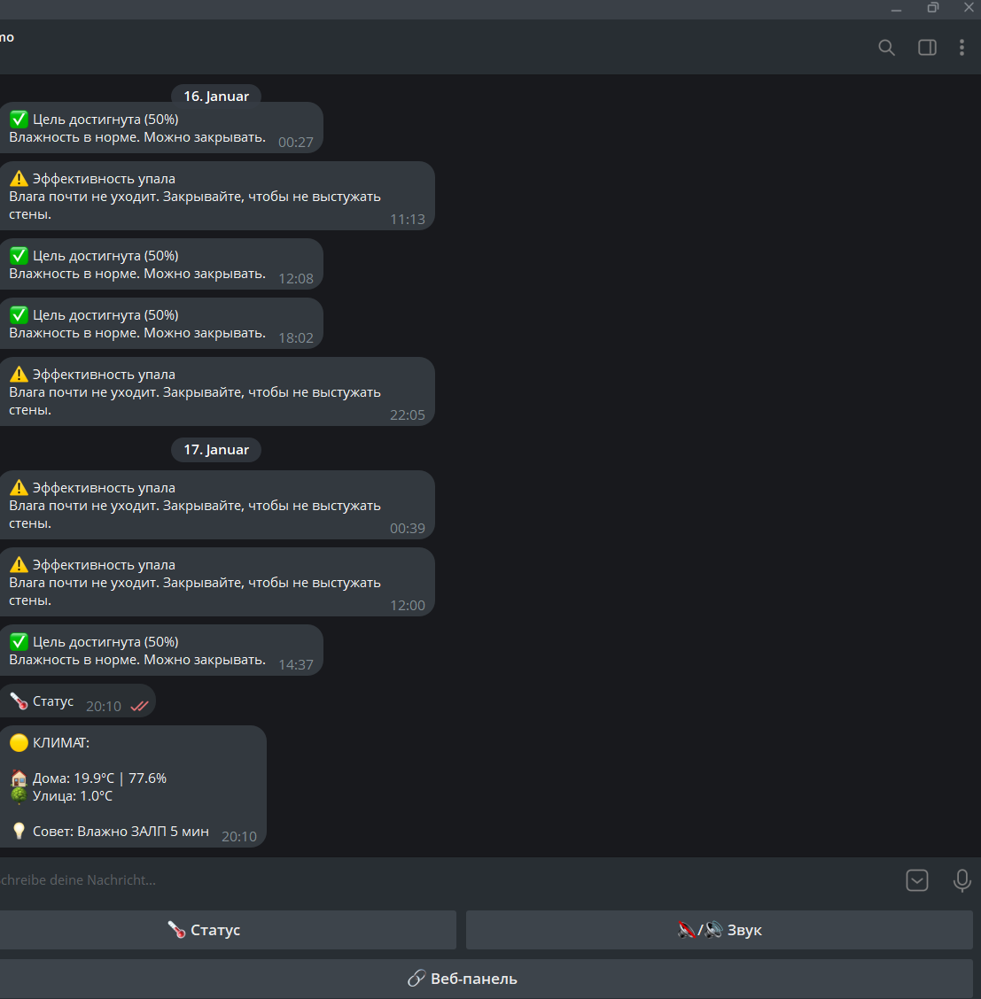
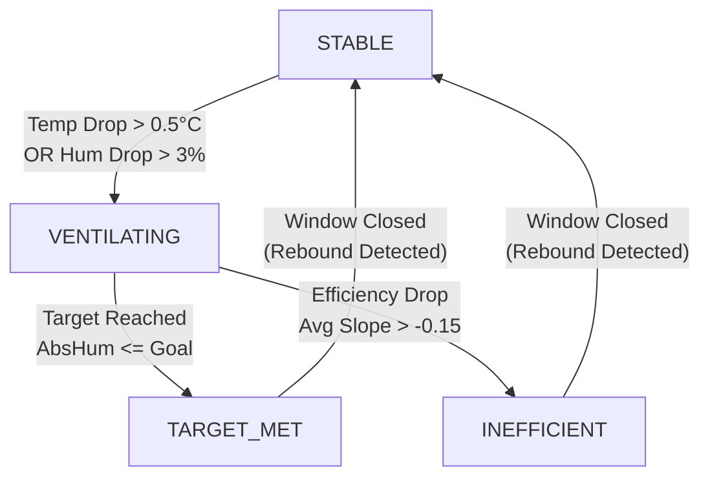

# 🏠 SmartRoomMonitor (ACM-1)


[](https://www.espressif.com/en/products/socs/esp32)
[](https://www.arduino.cc/)

[](https://www.arduino.cc/)
[](https://platformio.org/)
[](LICENSE)

---

## ✨ Features

- 📊 **Real-time monitoring** — Temperature, humidity, and dew point displayed on OLED and web dashboard.
- 🪟 **Smart window detection** — Automatically detects when you open/close windows using physics-based algorithms (Absolute Humidity).
- 🧠 **Physics Engine** — Uses Absolute Humidity (g/m³) rather than just Relative Humidity (%) ensuring accurate advice regardless of temperature changes.
- 🍄 **Mold risk alerts** — Proactively warns when the dew point margin becomes dangerously low (< 3°C).
- 🤖 **Telegram bot** — Receive notifications, check status, and control settings remotely.
- 🌐 **Web dashboard** — Beautiful dark-themed interface with live Chart.js graphs and history data.
- ⛅ **Weather API** — Integrates outdoor weather data (Open-Meteo) for context-aware ventilation advice.
- 🌙 **Night mode** — OLED display turns off automatically at night (configurable hours).

---

## 📸 Screenshots

| Web Dashboard | OLED Display | Telegram Bot |
|:-------------:|:------------:|:------------:|
|  |  |  |

> *Note:* The web dashboard screenshot above was translated to English for demonstration purposes. The actual device interface and Telegram bot use **Russian language**, as this system was built for personal home use.

> *Privacy Note:* The IP address shown on the OLED screen (e.g., 192.168.x.x) is a local network address and is not accessible from the outside internet.

---

## 🔧 Hardware

| Component | Model | Connection |
|-----------|-------|------------|
| Microcontroller | ESP32 DevKit V1 | — |
| Sensor | DHT22 (AM2302) | GPIO 14 |
| Display | 0.96" OLED SSD1306 (128×64) | I2C (SDA: 21, SCL: 22) |

### ⚠️ Calibration Note

This project is designed as an "All-In-One" box solution. Due to the heat generated by the ESP32 chip inside the enclosure, the DHT22 readings are affected. 

**Software calibration is applied in `SensorManager.cpp`:**
- **Temperature:** `-2.0°C` offset (compensates for self-heating).
- **Humidity:** `+10.9%` offset (linear correction).

> *If you build this with the sensor placed outside the case, you should reset these offsets in `Settings.h` to 0.*

---

## 🛠️ Installation

### Prerequisites
- [PlatformIO](https://platformio.org/install) (VS Code extension recommended)
- ESP32 Development Board

### Setup Steps

1. **Clone the repository**
   ```bash
   git clone https://github.com/YOUR_USERNAME/SmartRoomMonitor.git
   cd SmartRoomMonitor
   ```

2. **Configure Settings**
   The project requires a `Settings.h` file which contains your private credentials (WiFi, Tokens). 
   Use the provided template:
   
   ```bash
   # Copy the template
   cp include/SettingsTemplate.h include/Settings.h
   ```

3. **Edit `include/Settings.h`**
   Open the file and fill in your details:
   - `WIFI_SSID` / `WIFI_PASS`: Your network credentials.
   - `BOT_TOKEN`: Telegram bot token from @BotFather.
   - `OWNER_CHAT_ID`: Your Telegram User ID (get it from @userinfobot).
   - `WEATHER_API_URL`: Update coordinates for your city (default: Weiden, Germany).

4. **Build & Upload**
   Connect your ESP32 and run:
   ```bash
   pio run --target upload
   ```

---

## 🧠 How It Works: The Smart State Machine

The core logic uses a 4-state machine to manage ventilation cycles effectively:



1. **STABLE**: Monitors climate every 2 minutes. Saves energy.
2. **VENTILATING**: High-frequency polling (6s). Tracks moisture removal.
3. **TARGET_MET**: Signal to close window (Goal reached).
4. **INEFFICIENT**: Signal to close window (Ventilation no longer effective, e.g., raining outside).

---

## 📁 Project Structure

```
SmartRoomMonitor/
├── docs/                    # Documentation assets & images
├── include/                 # Header files
│   ├── ClimateMath.h        # Physics calculations (Dew Point, Abs Humidity)
│   ├── DisplayManager.h     # OLED UI interface
│   ├── SensorManager.h      # Core logic & State Machine
│   ├── SettingsTemplate.h   # 📝 Template for your credentials (WiFi, Keys)
│   ├── TelegramManager.h    # Bot communication
│   ├── WeatherManager.h     # Open-Meteo API integration
│   └── WebManager.h         # Async Web Server & JSON API
├── src/                     # Source Code (.cpp implementation)
│   ├── main.cpp             # Setup & Loop orchestration
│   └── ...                  # Implementation of managers
├── documentation.md         # Full Technical Documentation (English)
├── documentation_ru.md      # Full Technical Documentation (Russian)
├── platformio.ini           # Project build configuration
└── README.md                # This file
```

---

## 📖 Documentation

For a deep dive into the code, thread safety, and logic explanation:

- 🇬🇧 **[English Documentation](documentation.md)**
- 🇷🇺 **[Russian Documentation (Original)](documentation_ru.md)**

---

## 📡 API Endpoints

| Endpoint | Method | Description |
|----------|--------|-------------|
| `/` | GET | Main Dashboard (HTML) |
| `/api/status` | GET | Current live readings & advice (JSON) |
| `/api/history` | GET | Full history buffer (Chunked JSON Stream) |

---

## 📦 Dependencies

- **Adafruit SSD1306 & GFX** (Display)
- **DHT Sensor Library** (Sensors)
- **ArduinoJson** (Data serialization)
- **ESPAsyncWebServer** & **AsyncTCP** (Web Interface)
- **UniversalTelegramBot** (Notifications)

---

## 📄 License

This project is open source and available under the [MIT License](LICENSE).
