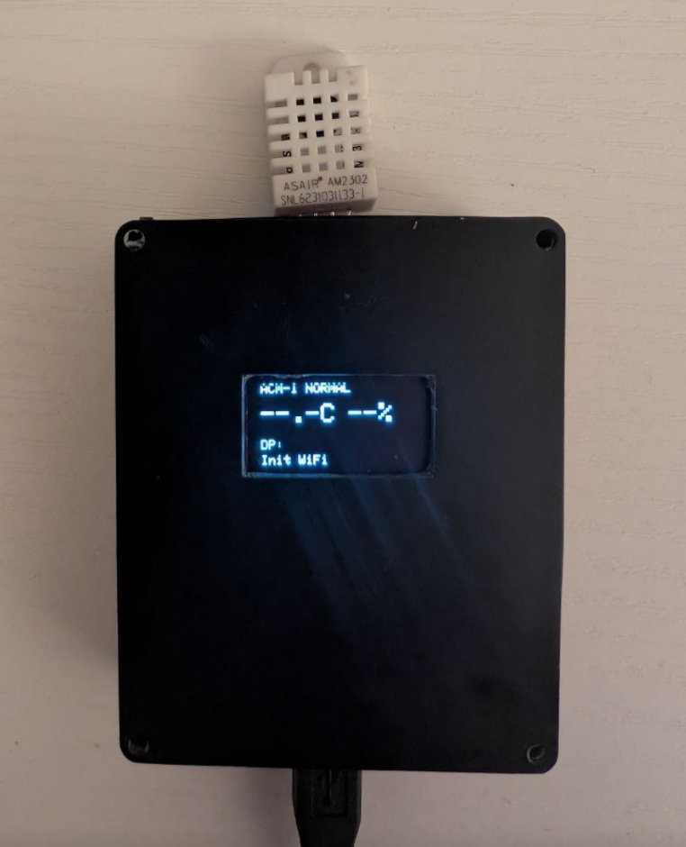

# SmartRoomMonitor (ACM-1)

**Autonomous climate monitoring system built on ESP32 with physics-based ventilation analysis, real-time notifications, and a responsive web interface.**


---

## Overview

This project implements a smart indoor climate monitor that goes beyond simple temperature/humidity display. It uses **Absolute Humidity calculations** to accurately detect ventilation events, track their effectiveness, and provide actionable recommendations — all running on a resource-constrained microcontroller.

The system was developed for personal use (interface in Russian) and serves as a practical case study in embedded systems design, covering real-time data processing, concurrent task management, and stable long-term operation.

---

## Technical Highlights

### Embedded Systems & Concurrency
- **Dual-core utilization**: Sensor reading task pinned to Core 1, network/UI tasks on Core 0
- **FreeRTOS task management** with `vTaskDelayUntil` for precise timing intervals
- **Thread-safe data access** using `std::timed_mutex` with configurable timeouts
- **Watchdog-safe streaming**: Chunked HTTP responses with periodic yields to prevent WDT resets

### Algorithm Design
- **4-state finite state machine** for ventilation cycle management (STABLE → VENTILATING → TARGET_MET / INEFFICIENT)
- **Physics-based detection**: Uses Absolute Humidity (g/m³) instead of Relative Humidity (%) to eliminate temperature-induced false positives
- **Sliding window analysis**: 6-point buffer (3 min) for plateau detection with configurable slope thresholds
- **Rebound detection v2.0**: Trend-based window close detection (+0.15°C over 2 min) with fallback heuristics
- **Adaptive target calculation**: Dynamic humidity goal based on starting conditions (`max(50%, startHum - 15%)`)

### Memory & Stability
- **Zero heap allocation in hot paths**: Static ring buffer (500 entries), no `String` objects in runtime loops
- **Chunked JSON streaming** for `/api/history` endpoint — sends data in 32-record batches to avoid stack overflow
- **EMA filtering** with anomaly rejection (jumps > 2°C discarded) for sensor stability
- **Deterministic baseline updates** every 50 readings (~5 min) — no `rand()` calls

### Integration
- **Telegram Bot API**: Subscriber management, state-change notifications, mold risk alerts with hysteresis
- **Open-Meteo Weather API**: Outdoor humidity comparison for context-aware ventilation advice
- **Async HTTP Server** (ESPAsyncWebServer): Non-blocking request handling with live Chart.js dashboard
- **NTP time sync** with automatic reconnection logic

---

## Screenshots

| Web Dashboard | OLED Display | Telegram Bot |
|:-------------:|:------------:|:------------:|
|  |  |  |

> The dashboard screenshot was translated to English for this README. The actual device interface uses Russian, as it was built for personal home use.

---

## System Architecture

The firmware runs on ESP32's dual-core processor with FreeRTOS:

```
┌───────────────────────────────────────────────────────────────────────────┐
│                              ESP32 Dual-Core                              │
├───────────────────────────────────┬───────────────────────────────────────┤
│          CORE 0 (PRO_CPU)         │          CORE 1 (APP_CPU)             │
│      Protocol & System Tasks      │        Application Tasks              │
├───────────────────────────────────┼───────────────────────────────────────┤
│  • WiFi driver                    │  • Arduino loop()                     │
│  • TCP/IP stack                   │    - Telegram polling                 │
│  • AsyncTCP (WebServer backend)   │    - Display updates                  │
│  • NTP client                     │    - Weather API calls                │
│  • System watchdog                │    - Connectivity checks              │
│                                   │                                       │
│                                   │  • sensorTask (FreeRTOS)              │
│                                   │    - DHT22 reading (6s interval)      │
│                                   │    - Calibration & EMA filtering      │
│                                   │    - State machine transitions        │
│                                   │    - History logging                  │
└───────────────────────────────────┴───────────────────────────────────────┘
                                    │
                    ┌───────────────┴───────────────┐
                    │       Shared Resources        │
                    │    (Mutex-protected access)   │
                    ├───────────────────────────────┤
                    │  • History buffer [500]       │
                    │  • Current readings (T/H/DP)  │
                    │  • Climate state              │
                    │  • Advice cache               │
                    └───────────────────────────────┘
```

**Data Flow:**
1. `sensorTask` reads DHT22 every 6 seconds, processes data, updates state machine
2. `loop()` periodically logs history, updates display, polls Telegram
3. `WebManager` (AsyncTCP) serves HTTP requests, reads shared data via mutex
4. All modules access `SensorManager` data through thread-safe getters

---

## State Machine Logic

The ventilation detection uses a 4-state model based on Absolute Humidity dynamics:

| State | Trigger | Behavior |
|-------|---------|----------|
| **STABLE** | Default / Window closed | Low-frequency logging (3 min), baseline tracking |
| **VENTILATING** | Humidity drop >3% or Temp drop >0.5°C | High-frequency logging (30s), slope monitoring |
| **TARGET_MET** | AbsHum reaches adaptive goal | Notification sent, awaiting window close |
| **INEFFICIENT** | Slope > -0.15 g/m³ over 3 min (plateau) | Notification sent, ventilation no longer effective |

Transitions back to STABLE occur on **rebound detection** (temperature trend reversal) or 1-hour timeout.

---

## Hardware

| Component | Specification |
|-----------|---------------|
| MCU | ESP32-WROOM-32 (Dual-core, 240 MHz, reduced to 80 MHz for thermal stability) |
| Sensor | DHT22 / AM2302 (GPIO 14) |
| Display | SSD1306 OLED 128×64 (I2C: SDA 21, SCL 22) |

### Design Note: Sensor Calibration

The enclosure is a compact box housing the ESP32, OLED display, and DHT22 sensor. The display is mounted on the lid (visible through a cutout), while the sensor was originally intended to protrude from the top like an antenna.



**Problem discovered during testing:** The ESP32 generates heat during operation, which significantly affected temperature readings when the sensor was inside the case. This thermal coupling issue was not anticipated during the initial design phase.

**Solution (hardware):** The sensor was pulled out as far as mechanically possible. In the final build, only ~1 cm of the sensor leads (with soldered wires) remain visible through the top opening. The sensor body now sits partially outside the enclosure.

**Solution (software):** Residual thermal offset is compensated via calibration constants:
- Temperature: **−2.0°C**
- Humidity: **+10.9%**

This was a first-iteration prototype with no resources for a complete redesign. The software calibration made it functional despite the hardware constraints.

---

## Project Structure

```
SmartRoomMonitor/
├── include/
│   ├── ClimateMath.h         # Dew point & absolute humidity formulas
│   ├── SensorManager.h       # State machine, history buffer, mutex
│   ├── DisplayManager.h      # OLED rendering with night mode
│   ├── WebManager.h          # Async server, API endpoints
│   ├── WeatherManager.h      # Open-Meteo integration
│   ├── TelegramManager.h     # Bot commands, subscriber list
│   └── SettingsTemplate.h    # Configuration template (credentials)
├── src/
│   ├── main.cpp              # Initialization, main loop, connectivity
│   ├── SensorManager.cpp     # Core logic implementation
│   ├── DisplayManager.cpp    # UI rendering
│   ├── WebManager.cpp        # HTTP handlers, chunked streaming
│   ├── WeatherManager.cpp    # API requests
│   └── TelegramManager.cpp   # Notification logic
├── docs/
│   └── images/               # Screenshots
├── documentation.md          # Technical documentation (English)
├── documentation_ru.md       # Technical documentation (Russian)
└── platformio.ini            # Build configuration
```

---

## Installation

1. Clone repository
2. Copy `include/SettingsTemplate.h` to `include/Settings.h`
3. Fill in WiFi credentials, Telegram bot token, and location coordinates
4. Build and upload via PlatformIO: `pio run --target upload`

---

## API Reference

| Endpoint | Method | Response |
|----------|--------|----------|
| `/` | GET | HTML dashboard with live charts |
| `/api/status` | GET | JSON: current readings, advice, debug info |
| `/api/history` | GET | JSON array: timestamped history (chunked stream) |

---

## Dependencies

- Adafruit SSD1306 / GFX
- DHT sensor library
- ArduinoJson
- ESPAsyncWebServer + AsyncTCP
- UniversalTelegramBot

---

## Documentation

Detailed technical documentation covering code structure, algorithms, and design decisions:

- [English version](documentation.md)
- [Russian version (original)](documentation_ru.md)

---

## License

MIT License. See [LICENSE](LICENSE) file.
